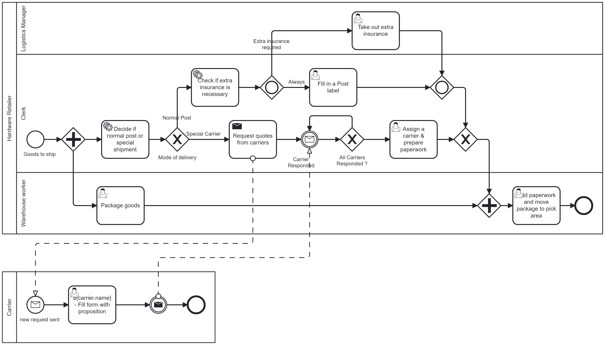

# Camunda 7 Tutorial Project

This repository hosts a Camunda 7 project that demonstrates a sample shipment process. 
The process is designed, modeled, configured, and deployed using the Camunda process engine. 

Below is the BPMN diagram representing the process for this project.
